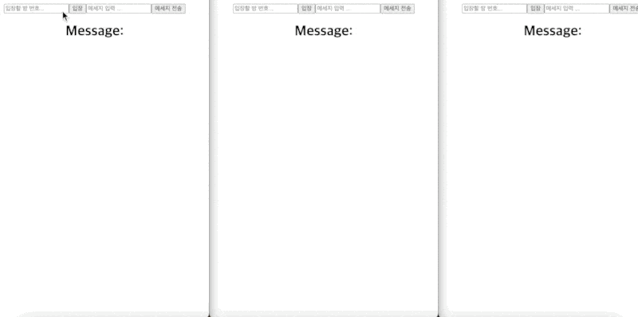

# SOCKET IO 연습하기

# 폴더 구조

## client / server

# 실행 방법

## client 에서 npm run start

## server 에서 nodemon server.js

# 학습한 내용

1. socket io 서버 설정
2. io.on("connection", callback) 으로 클라이언트와 서버가 연결되었을 때 발생하는 이벤트 처리
3. socket.on(eventName, callback):소켓 객체가 특정 이벤트를 수신할 때 콜백 함수를 호출
4. socket.join : 특정 방이나 채널에 추가하는 데 사용
5. socket.to(room).emit(event, data) : 특정 방에 있는 모든 클라이언트에게 이벤트와 데이터를 전송.

